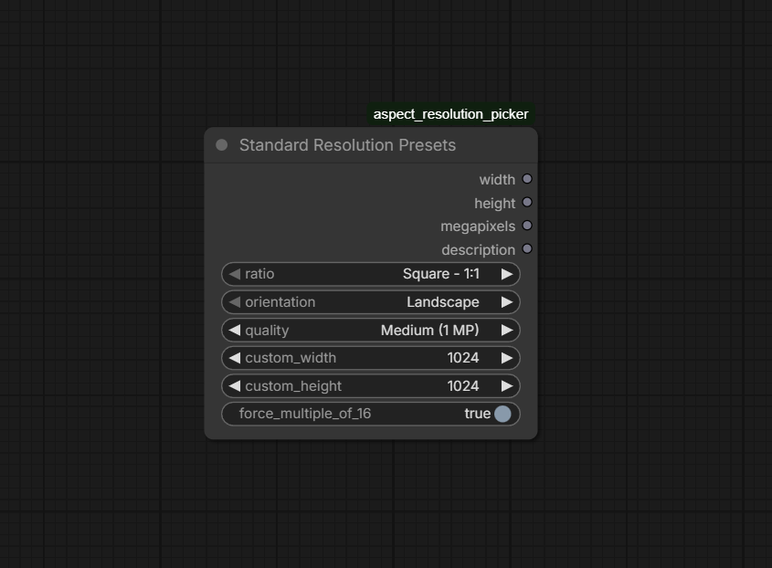

# Standard Resolution Presets - ComfyUI Custom Node

A ComfyUI custom node that provides quick access to standard image resolutions for AI image generation. Perfect for workflows that need consistent, high-quality output dimensions.



## Features

- **4 Aspect Ratios**: Square (1:1), Classic (4:3), Cinematic (16:9), Ultrawide (21:9)
- **2 Orientations**: Landscape or Portrait
- **4 Quality Levels**: Draft (0.5 MP), Standard (1 MP), High (2 MP), Ultra (4 MP)
- **Custom Mode**: Manual width/height input with min 64, max 2048
- **Auto-snap**: Optional multiple of 16 alignment for optimal AI generation

## Installation

1. Navigate to your ComfyUI custom nodes folder:
   ```
   ComfyUI/custom_nodes/
   ```

2. Clone the repository:
   ```bash
   git clone https://github.com/vimal-v-2006/standard-resolution-presets-comfyui-custom-node.git
   ```
   
   Or download and extract the ZIP file to create:
   ```
   ComfyUI/custom_nodes/standard_resolution_presets-comfyui-custom-node/
   ```

3. Restart ComfyUI

## Usage

1. Search for **"Standard Resolution Presets"** in the node search bar (press `Ctrl+F` or `Tab`)
2. Or find it under **Resolution** category in the sidebar
3. Configure your desired settings:
   - **Ratio**: Choose aspect ratio (1:1, 4:3, 16:9, 21:9)
   - **Orientation**: Landscape or Portrait
   - **Quality**: Draft / Standard / High / Ultra
   - **Custom** (optional): Manual width/height input

4. Connect the outputs to your workflow:
   - `width` → Image Width node input
   - `height` → Image Height node input
   - `megapixels` → For display/info
   - `description` → String description of selected resolution

## Presets Table

| Aspect Ratio | Quality | Resolution | Megapixels |
|-------------|---------|------------|-----------|
| **1:1** (Square) | Draft (0.5 MP) | 512 × 512 | 0.26 MP |
| | Standard (1 MP) | 1024 × 1024 | 1.05 MP |
| | High (2 MP) | 1536 × 1536 | 2.36 MP |
| | Ultra (4 MP) | 2048 × 2048 | 4.19 MP |
| **4:3** (Classic) | Draft (0.5 MP) | 768 × 576 | 0.44 MP |
| | Standard (1 MP) | 1024 × 768 | 0.79 MP |
| | High (2 MP) | 1600 × 1200 | 1.92 MP |
| | Ultra (4 MP) | 2048 × 1536 | 3.14 MP |
| **16:9** (Cinematic) | Draft (0.5 MP) | 768 × 432 | 0.33 MP |
| | Standard (1 MP) | 1280 × 720 | 0.92 MP |
| | High (2 MP) | 1920 × 1080 | 2.07 MP |
| | Ultra (4 MP) | 2560 × 1440 | 3.68 MP |
| **21:9** (Ultrawide) | Draft (0.5 MP) | 960 × 432 | 0.41 MP |
| | Standard (1 MP) | 1728 × 768 | 1.33 MP |
| | High (2 MP) | 2560 × 1080 | 2.76 MP |
| | Ultra (4 MP) | 3440 × 1440 | 4.95 MP |

*Note: Portrait orientation swaps width and height automatically.*

## Quality Guide

| Quality | Use Case |
|---------|---------|
| ⚡ Draft (0.5 MP) | Quick previews, fast iterations, testing prompts |
| 🔥 Standard (1 MP) | Daily generation, social media, thumbnails |
| 🎯 High (2 MP) | Print-quality, detailed work, posters |
| 💎 Ultra (4 MP) | High-res output, large prints, professional work |

## Outputs

- **width** (INT): Selected width in pixels
- **height** (INT): Selected height in pixels  
- **megapixels** (FLOAT): Actual megapixels (rounded to 2 decimals)
- **description** (STRING): Human-readable description

## License

MIT License - Feel free to use in your ComfyUI workflows.

---

*Built for AI artists who need quick, consistent image resolutions.*